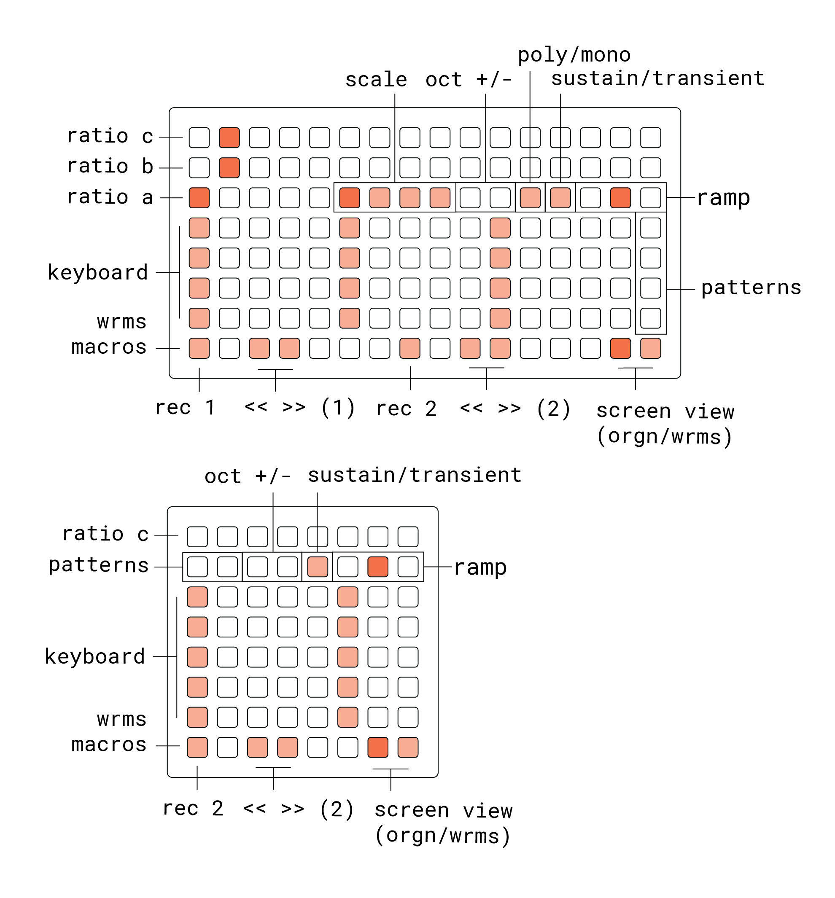

# orgnwrms

orgn + wrms

## requirements

- norns (210927 or later)
- orgn (v1.1 or later)
- wrms (v2.1 or later)
- grid (any size) or midi keyboard

## documentation

### grid

the grid layout is the same as orgn, but with an additional row of macros for controlling wrms (record + octave transpose) from the grid

### norns
